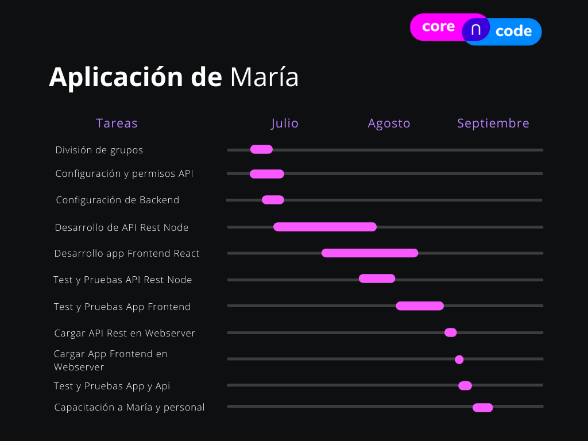

# v202007

## Antecedentes

Recientemente, aplicaciones móviles de mensajería como WhatsApp, han habilitado un canal de comunicación entre negocios y consumidores que presenta un catálogo de nuevas oportunidades para desarrollar herramientas que agilicen esta nueva dinámica de las operaciones de compra-venta.

## Descripción del problema

Esta actualización en la forma en la que los consumidores solicitan productos y servicios a través de mensajería móvil como WhatsApp Business, presenta nuevos retos para los operadores de negocios que aún no han sido resueltos por aplicaciones web o móviles.

Por ejemplo:

### Negocio de Hamburguesas

María opera un negocio de hamburguesas en una buena zona de la capital. Actualmente envía su catálogo de hamburguesas en formato PDF o JPG a los clientes que lo solicitan. María tiene en la galería de su celular el catálogo y a veces recuerda enviar el link al catálogo que WhatsApp Business ofrece dentro de la aplicación.

Cuando el cliente ha elegido lo que desea ordenar, María envía una respuesta predeterminada parecida a esto:

```
Gracias por comprar nuestras hamburguesas.
Por favor, indica la siguiente información para completar tu orden:

- Nombre de quien recibe
- Productos que ordena
- NIT para factura
- Dirección de entrega
- Medio de pago
```

En algunas ocasiones, a pesar de que este cliente ya había solicitado hamburguesas con anterioridad, María atiende tantas órdenes a través de 1 sólo dispositivo, que se le hace imposible mantener un registro de clientes frecuentes, eliminando así la atención personalizada que podría ofrecer.

Una vez que el cliente responde:

```
- Jorge Pérez
- 1 vegana, 2 papas fritas, 2 refrescos
- 123456 Corporación Sublime, SA
- 5a Av. 19-35, Zona 0
- Efectivo, contra entrega
```

María inicia el siguiente protocolo:

- Ingresa la orden a su cocina, a través del sistema con el que cuente
- Envía manualmente el total de la orden al cliente:

```
Hemos recibido tu orden.
El total es de Q259.00, a contra entrega

Tu pedido llegará a tu puerta alrededor de las 12:30
Que disfrutes tu hamburguesa!
```

- Hace _forward_ de la información a un mensajero
- Está pendiente de que el pedido se entregue
- Envía la factura como screenshot

Falta mencionar los casos en donde el cliente exige su entrega a tiempo. O actualización de las órdenes por modificaciones previas a la entrega.

En ocasiones, María ha enviado órdenes incompletas o equivocadas.

## Descripción de la Solución

Así como María, cientos de otros operadores de negocios se encuentran en la misma situación, intentando adaptarse a la alta demanda de sus productos y servicios por canales de mensajería, llegando a un límite de su eficiencia y control.

Por lo tanto, se propone gestionar los mensajes mediante la API (siglas de '_Application Programming Interface_') de Whatsapp Business, ya que la misma nos permite crear una interacción con usuarios mediante una [plantilla de mensajes](https://developers.facebook.com/docs/whatsapp/message-templates) almacenados en una base de datos, también se puede crear una plantilla de mensajes multimedia que serán de utilidad para la mejor interacción con los usuarios.

Esta información puede ser enviada mediante una API personalizada a un servicio que será manipulado y maquetado para que María tenga una interfaz agradable, puede ver los pedidos en un orden cronológico con forme van llegando para que no exista un descontrol en cada pedido.

En la interfaz gráfica se dividirá en varias vistas 
- La vista de pedidos donde se confirmará el pedido ahí se mostrará todo lo que el cliente solicito y se trabajara con esa información al completar la orden se marcará como pedido completado, automáticamente hará desaparezca de la pantalla de pedidos y así estos pedidos van siendo almacenados en otra vista de pedidos en estado de entrega.
- La vista de pedidos enviados mostrara la información de donde se encuentra el pedido actualmente para que María vea e informe al cliente el estado de su pedido si este lo solicita, cliente o el repartidor confirma que el pedido ha sido entregado correctamente, esto cambiara el estado del pedido de en camino a entregado, automáticamente se procede a hacer el cobro del pedido enviado.
- La vista de clientes satisfechos para los que envían un feedback o recomendación del servicio, esta información puede ser mostrada en un espacio público del sitio de María.
- La vista pública del sitio de María donde se puede mostrar la información de los platillos que ofrece y los feedbacks de los clientes que han utilizado el servicio, también enlaces a las redes sociales y como enviar pedidos por medio de Whatsapp.
- La vista para usuarios bloqueados que solo envían mensajes de bromas o que por alguna razón solicitan pedidos que no piensan pagar.

Esta información tiene que ser almacenada para poder generar un historial de pedidos y en el que María tenga un inventario de cuanto ha vendido en cada día y poder ofreciendo un mejor servicio a sus clientes.

En el backend de la aplicación se manipulará la información recibida por el api de Whatsapp y se enviara a la aplicación cliente de María, se recibirán las acciones realizadas y se le enviara respuesta mediante el api de Whatsapp al usuario, esta app será la encargada de servir como intermediario entre el api y la aplicación cliente.

## Tecnologías

### Api de Whatsapp
* [Api de Whatsapp Business](https://developers.facebook.com/docs/whatsapp)
    - [Guías de la API de WhatsApp Business](https://developers.facebook.com/docs/whatsapp/guides) 
    - [Registro](https://developers.facebook.com/docs/whatsapp/api/account)
    - [WhatsApp Business API Installation](https://developers.facebook.com/docs/whatsapp/installation)
        * [WhatsApp-Business-API-Setup-Scripts](https://github.com/WhatsApp/WhatsApp-Business-API-Setup-Scripts/tree/master/installation)
    - [Plantillas de mensajes](https://developers.facebook.com/docs/whatsapp/message-templates)
* [Docker Compose](https://docs.docker.com/compose/install/?fbclid=IwAR0iVXUx_wDZDNC2zV60ddMd-oSwdyXP4o8vGsiq5paS9b1od814o4SNGhs)
* [MySQL](https://www.mysql.com/) o [Postgres](https://www.postgresql.org/)

### Frontend y Backend

* [React](https://es.reactjs.org/)
* [Servidor Web linux](https://es.wikipedia.org/wiki/Servidor_web)
* [NGINX](https://www.nginx.com/)
* [Node.js](https://nodejs.org/es/)
* [Socket.io](https://socket.io/)


## Tiempo de entrega

Se estima un tiempo de entrega de 2 meses y medio



## Presupuesto

USD 32,000

### Costos de infraestructura

USD 500 / mes
